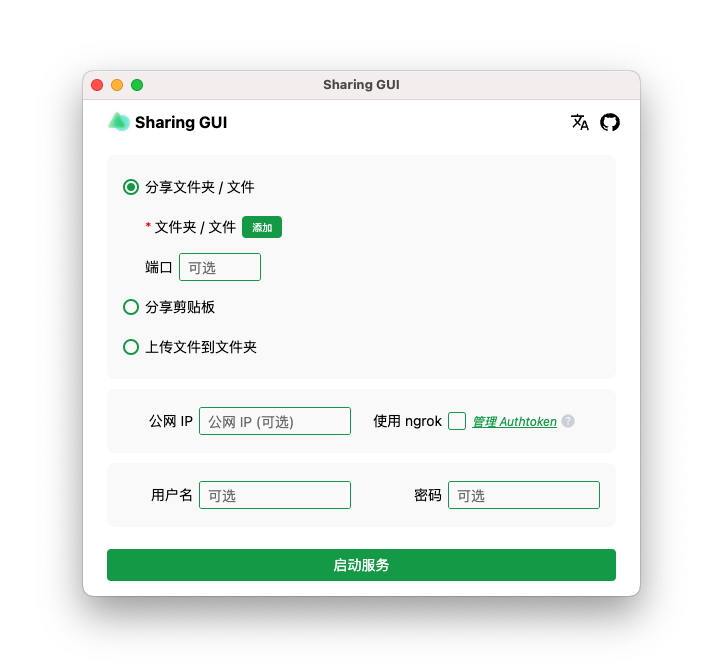

<p align="center">
<br>

<br><br><br>
</p>

轻松地将文件共享到局域网 / 公共网络上的多个设备。

# Sharing GUI

简体中文 | [English](./README.md)

Sharing GUI 是一个客户端，用于跨多个设备（iOS、Android、macOS、Windows、Linux…）共享文件

**只需要一个客户端**, 其他设备使用 WEB。（客户端支持 macOS，即将支持 Windows、Linux）

起初使用[parvardegr/sharing](https://github.com/parvardegr/sharing)作为核心，后来使用[imyuanx/sharing](https://github.com/imyuanx/sharing)

## 下载

可以从[GitHub Releases](https://github.com/imyuanx/sharing-GUI/releases)下载安装，当然你也可以克隆代码自己打包（见下文）

## 特性

- 在其他设备上下载你的文件
- 接收其他设备上的文件
- 在其他设备上访问剪贴板
- 支持局域网、公网
- 支持身份认证
- 支持 [ngrok](https://ngrok.com/)，快速分享到公网

## 提示

- 支持同时共享多个目录还支持文件夹和文件的组合。
- 可以拖放目录或文件到软件。

## 预览



## 开发

### 安装依赖

```bash
yarn
```

### 开发模式

```bash
yarn dev
```

### 打包分发

```bash
yarn make
```

### 自定义核心

如果你需要自定义核心, 请查看[imyuanx/sharing](https://github.com/imyuanx/sharing)

我使用[pkg](https://github.com/vercel/pkg)将它打包成二进制文件
