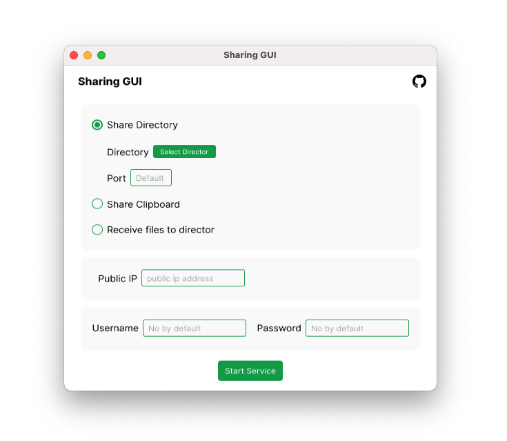

<p align="center">
<br>

<br><br><br>
</p>

Easily share files to multiple devices on the LAN/Public Network.

# Sharing GUI

English | [简体中文](./README-CN.md)

The Sharing GUI is a client that is used to share files across multiple devices (iOS, Android, macOS, Windows, Linux...)

**Only one client is required**, other devices use WEB. (client support macOS, Windows, Linux)

Start with [parvardegr/sharing](https://github.com/parvardegr/sharing) and then used [imyuanx/sharing](https://github.com/imyuanx/sharing)

## Installation

Download from [GitHub Releases](https://github.com/imyuanx/sharing-GUI/releases) and install it.

## Features

- Download your files on other devices
- Accept files on other devices
- Access your clipboard on other devices
- Support LAN/Public Network
- Support identity authentication
- Support [ngrok](https://ngrok.com/), quickly share to the public network

## Tips

- Support share multiple directories also supports the combination of folders and files.
- Drag and drop directories or files to window.

## Preview



## Development

### Install Dependencies

```bash
yarn
```

### Dev Mode

```bash
yarn dev
```

### Distribution

```bash
yarn make
```

### Custom Core

if your need custom core, visit this repo [imyuanx/sharing](https://github.com/imyuanx/sharing)

I use [pkg](https://github.com/vercel/pkg) package it into binary files
